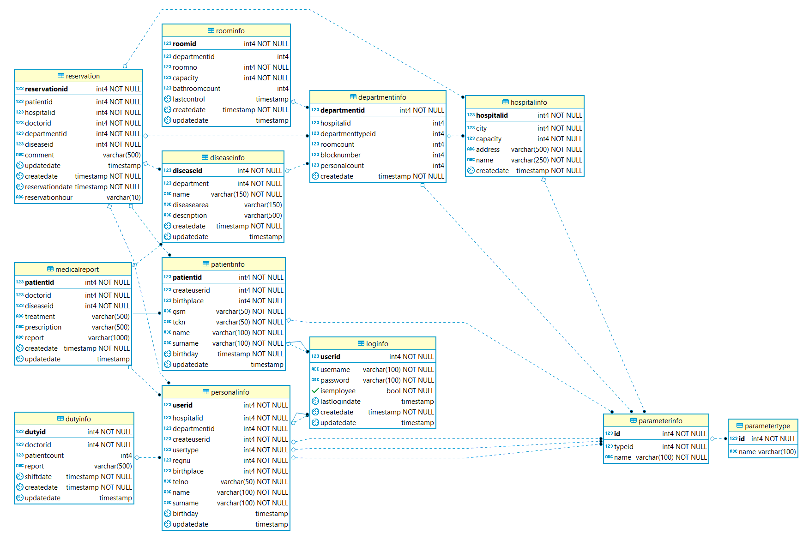

Development Process
===================

Database Design - Entity-Relationship Diagram
---------------------------------------------

This project consist of twelve main tables and two sub tables. The connection of the tables as well as their attributes are shown in the E-R Diagram below.

   E-R Diagram

.. toctree::

   orhan
   bilal
   utku
