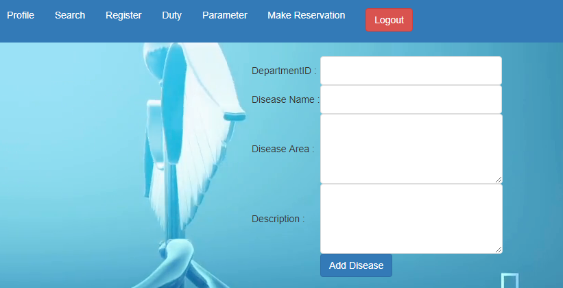
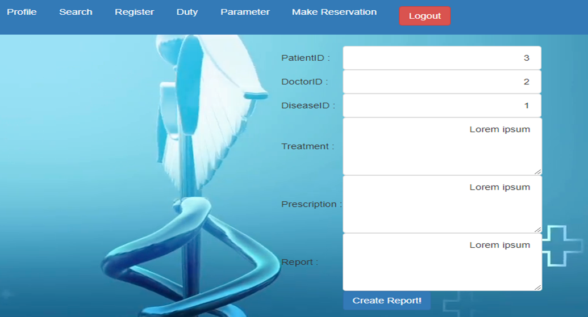
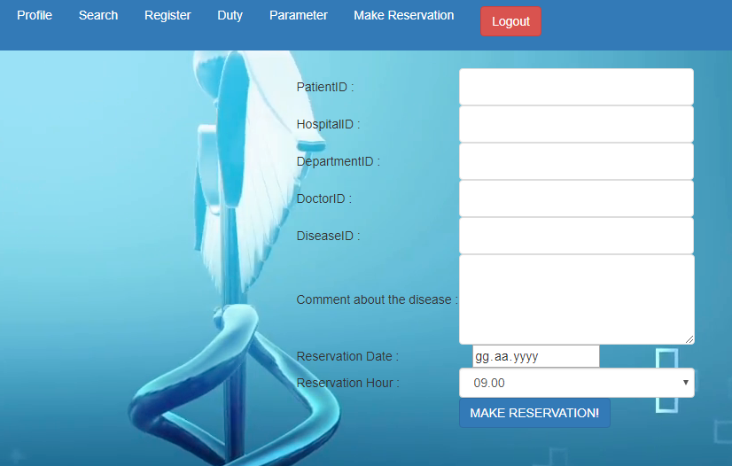
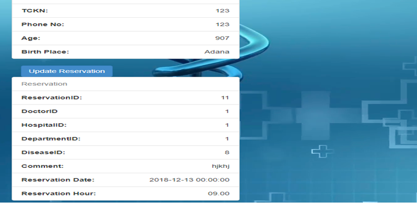
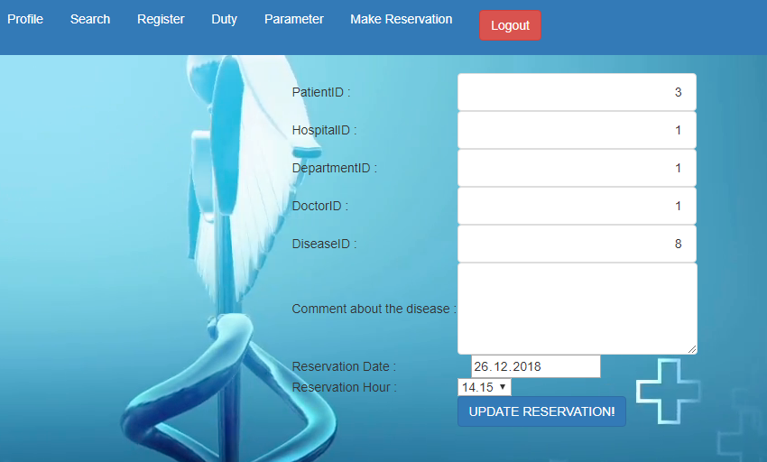

Parts Done By Bilal Can
=======================

Disease Page
--------------

Only the personnel of a hospital, and the admin can add diseases.

MedicalReport Page
--------------

Only the personnel of a hospital can arrange a new report.

Reservation Processes
--------------

:1) Making a Reservation:

It can be done by the patient or a personnel can do it on behalf of a patient.

:2) How can see a Reservation:

Each patient can see their reservations under their profile page. If they have no reservation registered on the system, this area is empty.

:3) Updating a Reservation:

In the profile page, the patient can click "update reservation" button to open a new page to update reservation information.

