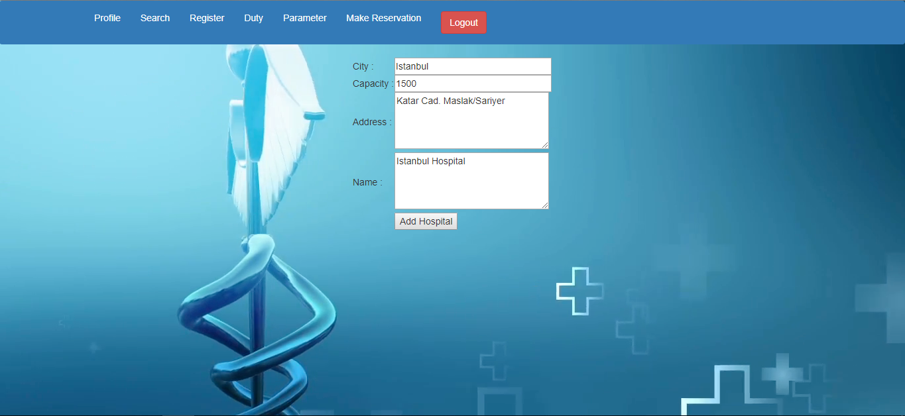
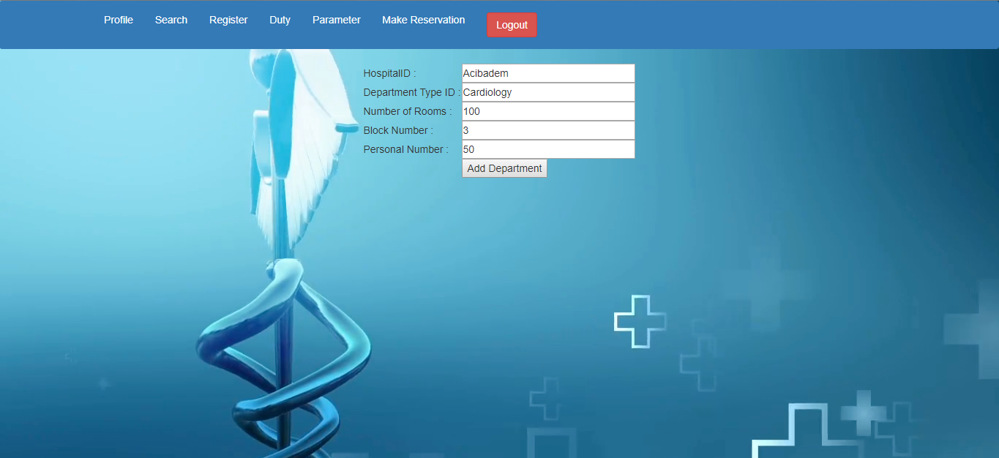
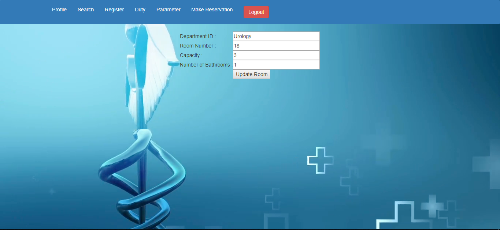

Parts Done By Orhan Kurto
=========================

Hospital Pages
--------------

Below presented pages of hospital information are reachable only by the admin since only admin can add/update hospital, department and room informations. Since the tables below are connected to each other, the order in which creation should be done is hospital > department > room.

:1) Add Hospital Page:

The page below is used to add a hospital to the database. All the parameters which need to be filled are signed as required so the hospital is added only when all parameters are inserted.

:2) Update Hospital Page:

Similarly to the add hospital page, the update hospital page consist of all required parameters. Only difference is that when update page is used, an extra attribute showing the update time of hospital is shown.

.. figure:: images/update_hospital.png

Department Pages
----------------

:1) Add Department Page:

The page below is used to add a department to the database. All the parameters which need to be filled are signed as required so the department is added only when all parameters are inserted.

:2) Update Department Page:

Similarly to the add department page, the update department page consist of all required parameters. Only difference is that when update page is used, an extra attribute showing the update time of department is shown.

.. figure:: images/update_department.png

Room Pages
----------

:1) Add Room Page:

The page below is used to add a room to the database. All the parameters which need to be filled are signed as required so the room is added only when all parameters are inserted.

.. figure:: images/add_room.png

:2) Update Room Page:

Similarly to the add room page, the update room page consist of all required parameters. Only difference is that when update page is used, an extra attribute showing the update time of room is shown.

